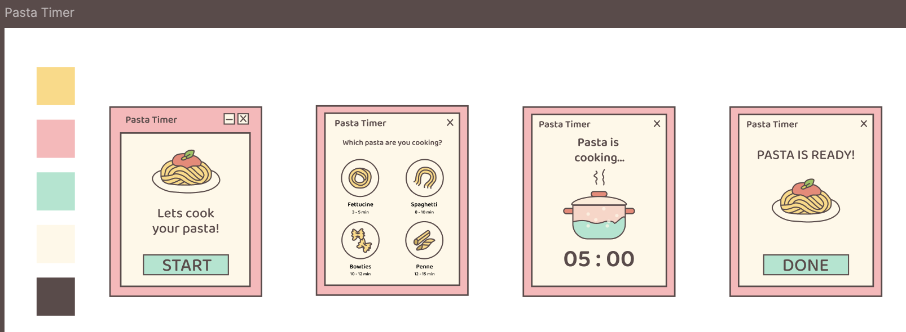

# 🍝 Pasta Timer

A beautiful desktop pasta timer application built with **Electron**, featuring custom-designed UI elements and an immersive cooking experience.

---

## 🌟 Overview

**Pasta Timer** is a desktop application that guides users through the pasta cooking process with an intuitive 4-page flow. It features custom pasta icons, animated cooking visuals, and audio feedback to create an engaging experience.

---

## 🎬 Demo


---

## 🎯 Features

- **Interactive Cooking Flow:** 4-page user journey from start to completion
- **Multiple Pasta Types:** Pre-configured timers for bow, spaghetti, fettuccine, and penne
- **Visual Feedback:** Animated boiling pot during cooking
- **Audio Experience:** Cooking sounds (tik-tak) during timer and alarm notification when complete
- **Timer Controls:** Pause and reset functionality
- **Custom UI:** Hand-drawn pasta icons and custom window controls (minimize/close)
- **Single Page Architecture:** Efficient section-based navigation
- **Custom Design:** Original Figma-designed interface

---

## 🗂 Application Flow

1. **Welcome Page:** Title screen with "Let's cook your pasta" button  
2. **Pasta Selection:** Choose from bow, spaghetti, fettuccine, or penne with preset cooking times  
3. **Active Timer:** Visual cooking animation with audio feedback and timer controls  
4. **Completion:** "Pasta is ready" notification with option to cook another batch  

---

## 💻 Technology Stack

- **Frontend:** Vanilla JavaScript, HTML, CSS  
- **Framework:** Electron with `electron-vite` for hot reloading  
- **Design:** Custom Figma designs with hand-drawn icons  
- **Audio:** Integrated cooking sounds and completion alerts  



---

## ⚙️ Requirements

- Node.js 20.19.0 or higher  
- npm package manager  

---

## 🚀 Installation

```bash
git clone https://github.com/caglaozbb/pasta-timer.git
cd pasta-timer
npm install
```

---

## 🏃‍♂️ Usage

### Development Mode
```bash
npm run dev
```

### Production Mode
```bash
npm start
```

---

## 🛠 Build Commands

- **Development:**  
  ```bash
  npm run dev
  ```  
  Run with hot reloading

- **Preview Production Build:**  
  ```bash
  npm start
  ```

- **Build Production:**  
  ```bash
  npm run build
  ```

- **Platform-specific Builds:**  
  ```bash
  npm run build:win   # Windows
  npm run build:mac   # macOS
  npm run build:linux # Linux
  ```

---

## 🖥 Platform Support

Developed and tested on **macOS**. Cross-platform compatibility expected thanks to Electron.

---

## 📂 Project Structure

Single-page application using **section-based navigation** for optimal performance and user experience.

